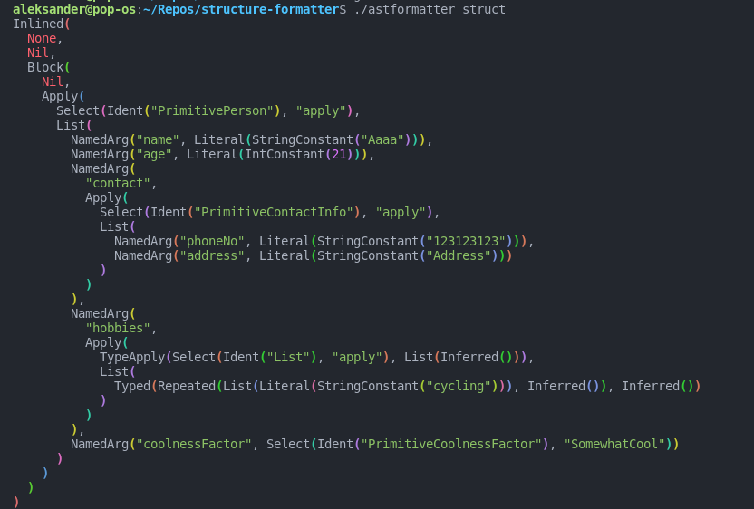

## ast-formatter

### Installation
#### Requirements:
* [scala-cli](https://scala-cli.virtuslab.org/install)
* [clang (optional if you want a Scala Native executable)](https://www.scala-native.org/en/latest/user/setup.html)

#### JVM executable:

```bash
scala-cli package https://gist.github.com/arainko/70c3a59e5ee8d36b926dfb386567f9af
```
#### Native executable:

```bash
scala-cli package --native https://gist.github.com/arainko/70c3a59e5ee8d36b926dfb386567f9af
```

### Usage
```
Usage: astformatter [--no-color] <filepath>

Formats the AST printed with Printer.TreeStructure.

Options and flags:
    --help
        Display this help text.
    --no-color
        Turn off ANSI color codes in the output.

Environment Variables:
    NO_COLOR=<string>
        Turn off ANSI color codes in the output.
```

### Example

Given the output of `Printer.TreeStructure` from `scala.quoted.quotes.reflect.*` copied to a file `struct`:

```scala
Inlined(None, Nil, Block(Nil, Apply(Select(Ident("PrimitivePerson"), "apply"), List(NamedArg("name", Literal(StringConstant("Aaaa"))), NamedArg("age", Literal(IntConstant(21))), NamedArg("contact", Apply(Select(Ident("PrimitiveContactInfo"), "apply"), List(NamedArg("phoneNo", Literal(StringConstant("123123123"))), NamedArg("address", Literal(StringConstant("Address")))))), NamedArg("hobbies", Apply(TypeApply(Select(Ident("List"), "apply"), List(Inferred())), List(Typed(Repeated(List(Literal(StringConstant("cycling"))), Inferred()), Inferred())))), NamedArg("coolnessFactor", Select(Ident("PrimitiveCoolnessFactor"), "SomewhatCool"))))))
```

Output:


### Motivation

You just got your hands on a fresh copy of Scala 3 and are running to your computer like a kid on Christmas Eve to try out some of that good-good metaprogramming. 

The first thing you try is printing the tree of a case class apply invocation and to do that you whip out this badboy:

```scala
import scala.quoted.*

object DebugMacros {
  inline def structure[A](inline value: A) = ${ structureMacro('value) }

  def structureMacro[A: Type](value: Expr[A])(using Quotes) = {
    import quotes.reflect.*

    val struct = Printer.TreeStructure.show(value.asTerm)
    report.info(struct)
    value
  }
}
```

and then proceed to print out your beatiful AST:

```scala
final case class PrimitivePerson(
  name: String,
  age: Int,
  contact: PrimitiveContactInfo,
  hobbies: List[String],
  coolnessFactor: PrimitiveCoolnessFactor
)

final case class PrimitiveContactInfo(phoneNo: String, address: String)

enum PrimitiveCoolnessFactor {
  case Uncool
  case Cool
  case SomewhatCool
}

DebugMacros.structure {
  PrimitivePerson(
    name = "Aaaa",
    age = 21,
    contact = 
      PrimitiveContactInfo(
        phoneNo = "123123123",
        address = "Address"
      ),
    hobbies = List("cycling"),
    coolnessFactor = PrimitiveCoolnessFactor.SomewhatCool
  )
}
```

and oh no, as you look at the output you notice that it isn't formatted in any way and you're left with a 600+ long singular line of characters:

```scala
Inlined(None, Nil, Block(Nil, Apply(Select(Ident("PrimitivePerson"), "apply"), List(NamedArg("name", Literal(StringConstant("Aaaa"))), NamedArg("age", Literal(IntConstant(21))), NamedArg("contact", Apply(Select(Ident("PrimitiveContactInfo"), "apply"), List(NamedArg("phoneNo", Literal(StringConstant("123123123"))), NamedArg("address", Literal(StringConstant("Address")))))), NamedArg("hobbies", Apply(TypeApply(Select(Ident("List"), "apply"), List(Inferred())), List(Typed(Repeated(List(Literal(StringConstant("cycling"))), Inferred()), Inferred())))), NamedArg("coolnessFactor", Select(Ident("PrimitiveCoolnessFactor"), "SomewhatCool"))))))
```

Here's where this project comes in, assuming you've already installed the script and copied the output over to a file (let's call the file `struct`) after invoking it you should be presented with an output like this:


or alternatively if you don't like colors or want to have the output viewable in your IDE you can call
```bash
./astformatter struct --no-color
```
or set the `NO_COLOR` env var in your shell.

Either way you do it, the output will look like this now:

```
Inlined(
  None, 
  Nil, 
  Block(
    Nil, 
    Apply(
      Select(Ident("PrimitivePerson"), "apply"), 
      List(
        NamedArg("name", Literal(StringConstant("Aaaa"))), 
        NamedArg("age", Literal(IntConstant(21))), 
        NamedArg(
          "contact", 
          Apply(
            Select(Ident("PrimitiveContactInfo"), "apply"), 
            List(
              NamedArg("phoneNo", Literal(StringConstant("123123123"))), 
              NamedArg("address", Literal(StringConstant("Address")))
            )
          )
        ), 
        NamedArg(
          "hobbies", 
          Apply(
            TypeApply(Select(Ident("List"), "apply"), List(Inferred())), 
            List(
              Typed(Repeated(List(Literal(StringConstant("cycling"))), Inferred()), Inferred())
            )
          )
        ), 
        NamedArg("coolnessFactor", Select(Ident("PrimitiveCoolnessFactor"), "SomewhatCool"))
      )
    )
  )
)
```


